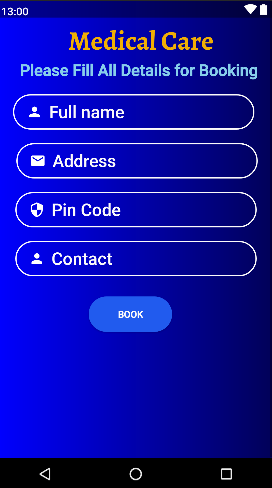
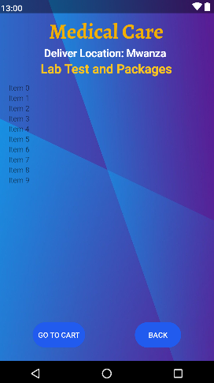
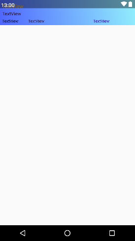

<a name="readme-top"></a>

[![Contributors][contributors-shield]][contributors-url]
[![Forks][forks-shield]][forks-url]
[![Stargazers][stars-shield]][stars-url]
[![Issues][issues-shield]][issues-url]
[![MIT License][license-shield]][license-url]
[![LinkedIn][linkedin-shield]][linkedin-url]


<!-- PROJECT LOGO -->
<br />
<div align="center">
  <a href="#">
    
  </a>

  <h3 align="center">Cross-Platform MedicalCare Application</h3>

  <p align="center">
    A cross-platform medical care application that connects patients and healthcare providers seamlessly. The application enables patients to schedule appointments, access medical records, receive telemedicine consultations, and interact with healthcare professionals. Healthcare providers use the desktop application for efficient management.
    <br />
    <a href="#"><strong>Explore the docs »</strong></a>
    <br />
    <br />
    <a href="#">View Demo</a>
    ·
    <a href="#">Report Bug</a>
    ·
    <a href="#">Request Feature</a>
  </p>
</div>


<!-- TABLE OF CONTENTS -->
<details>
  <summary>Table of Contents</summary>
  <ol>
    <li>
      <a href="#about-the-project">About The Project</a>
      <ul>
        <li><a href="#built-with">Built With</a></li>
      </ul>
    </li>
    <li>
      <a href="#getting-started">Getting Started</a>
      <ul>
        <li><a href="#prerequisites">Prerequisites</a></li>
        <li><a href="#installation">Installation</a></li>
      </ul>
    </li>
    <li><a href="#usage">Usage</a></li>
    <li><a href="#roadmap">Roadmap</a></li>
    <li><a href="#contributing">Contributing</a></li>
    <li><a href="#license">License</a></li>
    <li><a href="#contact">Contact</a></li>
    <li><a href="#acknowledgments">Acknowledgments</a></li>
  </ol>
</details>


<!-- ABOUT THE PROJECT -->
## About The Project

[](https://example.com)

I propose the development of a cross-platform medical care application for mobile 
devices and computers that aims to connect patients and healthcare 
providers seamlessly. The application used by patients in their mobile 
devices specifically smart phones will allow patients to schedule their 
appointments, access their medical records, receive telemedicine 
consultations, and interact with healthcare professionals who will be 
using the computer applications in their respective workplaces on a 
daily basis. Leveraging the power of Firebase, the applications will 
ensure real-time data synchronization between Android devices and 
desktop computers, ensuring a smooth and efficient healthcare experience.

Here's why:
* Tanzania is dealing with serious health issues, such as taking care of people's health because it does not have enough resources and its healthcare system is not very strong. 
* Many moms and kids get sick and even die from illnesses like HIV/AIDS, pneumonia, and malaria. Not many people have access to doctors and nurses. 
* The government is trying to make healthcare better by spending money on things like medicine and hospitals. But a big part of the money comes from other countries helping. 
* Not many people in Tanzania have health insurance, which helps pay for medical costs. The government wants to improve things like vaccines for kids and the quality of healthcare. 
* They also want companies to make medicine in Tanzania. However, local companies might face problems like not having enough skilled workers or good technology. ([Tanzania - Healthcare](https://www.trade.gov/country-commercial-guides/tanzania-healthcare))

Here's solution:
* I propose the creation of a cross-platform medical care app for mobile devices and computers, addressing healthcare challenges through technology. Computer technology (CT) solutions can significantly improve healthcare accessibility, especially in resource-limited rural areas. 
* The app will enable patients to easily schedule appointments, access medical records, and receive telemedicine consultations via smartphones, while healthcare providers will use computer applications for their tasks. 
* By utilizing Firebase, real-time data synchronization between Android devices and desktop computers will be ensured, enhancing healthcare experiences for both patients and professionals. 
* This solution aligns with the aim of my project to bridge healthcare gaps and enhance medical services for individuals and communities by harnessing the potential of CT solutions. ([Tanzania ICT in Healthcare](https://www.trade.gov/market-intelligence/tanzania-ict-healthcare))


<p align="right">(<a href="#readme-top">back to top</a>)</p>


### Built With

- Develop the Android application using Java in Android Studio.
- Build the Java desktop application using relevant Java libraries and Firebase SDK.
- Implement Firebase Realtime Database or Firestore for data storage and synchronization.
- Use Firebase Authentication for user registration and login.
- Apply Firebase Cloud Functions for custom business logic and data validation.
- Incorporate Firebase Security Rules to ensure data security and privacy compliance.
- Employ Firebase Hosting for web-based admin dashboard.


* [](https://www.java.com/)
* [](https://firebase.google.com/)
* [](https://developer.android.com/studio)


<p align="right">(<a href="#readme-top">back to top</a>)</p>


<!-- GETTING STARTED -->
## Getting Started

The project after unzipping the files you can open your android studio and
on the file section at the top of your navigation bar, you can choose open file option and select the 
unzipped folder which you trust and open a new window for the project and continue
to work with the project after that.

### Prerequisites

For testing you require an emulator for testing the working of the project. After 
installation of the emulator then you can continue to run the project on the emulator.


### Installation

_To install and run the Cross-Platform MedicalCare Application in Android Studio project from GitHub on your local machine, follow these steps:_

1. Install Android Studio:
* If you haven't already, download and install Android Studio on your computer.

2. Install Git:
* If Git is not already installed on your machine, download and install it from [https://git-scm.com/](https://git-scm.com/)

3. Clone the GitHub Repository:
* Open your terminal or command prompt.
* Navigate to the directory where you want to store the project using the `cd` command. For example:
   ```sh
   cd ~/Documents/AndroidProjects
   ```
* Clone the GitHub repository using the following command (replace repo-url with the actual URL of the GitHub repository you want to clone):

   ```sh
   git clone repo-url
   ```
    This will create a local copy of the project on your machine.

4. Open the Project in Android Studio:
* Launch Android Studio.
* Click on "Open an Existing Project" or "File" -> "Open..." in the Android Studio welcome screen.
* Navigate to the directory where you cloned the repository, select the project's root folder (usually contains the `build.gradle` files), and click "OK" to open the project.

5. Sync Gradle and Build the Project:
* Android Studio may prompt you to sync Gradle files. Click on the "Sync Now" link in the notification bar or go to "File" -> "Sync Project with Gradle Files" to ensure all project dependencies are resolved.
* Once the Gradle sync is complete, you can build the project by clicking the "Build" menu and selecting "Build Bundle(s) / APK(s)."

6. Run the Project:
* After a successful build, you can run the Android app on an emulator or a physical Android device. Make sure you have an emulator set up or connect a device via USB.
* Click the "Run" button (usually a green play button) in Android Studio's toolbar or go to "Run" -> "Run 'app'" to start the app.

7. Customize and Develop:
* You now have the project running on your local machine. You can make changes to the code, add features, and customize it to your needs.
<p align="right">(<a href="#readme-top">back to top</a>)</p>


<!-- USAGE EXAMPLES -->
## Usage

The cross-platform healthcare application aims to revolutionize the patient-provider interaction, providing a seamless experience across Android devices and desktop computers. By leveraging the capabilities of Firebase, the application will offer real-time data synchronization, authentication, and secure communication, enhancing healthcare services for patients and providers alike. With a dedicated team and a comprehensive approach, it will be possible, I am confident in delivering a successful and impactful healthcare solution.

<div style="display: flex; justify-content: space-between;">
  
  
  
</div>

<div style="overflow-x: auto; white-space: nowrap;">
  
  
  
  
  
  
  
  
  
  
    
  
  
  
  
  
  
  
  
  
  
  
  
  


</div>


_For more examples, please refer to the [Documentation](https://example.com)_

<p align="right">(<a href="#readme-top">back to top</a>)</p>


<!-- ROADMAP -->
## Roadmap

Here's the planned roadmap for the Cross-Platform MedicalCare Application:

### Short-Term Goals (Next 3-6 Months)

- [x] Add Changelog
- [x] Add "back to top" links
- [ ] Add Additional Templates with Examples
- [ ] Implement multi-language support (e.g., Chinese, Spanish)

### Medium-Term Goals (6-12 Months)

- [ ] Enhance user authentication and security features.
- [ ] Improve user interface and user experience (UI/UX) based on user feedback.
- [ ] Implement a notification system for appointment reminders and updates.
- [ ] Optimize performance and scalability of the application.
- [ ] Conduct regular security assessments to maintain data integrity.
- [ ] Explore partnerships with healthcare organizations for wider adoption.

### Long-Term Goals (12+ Months)

- [ ] Expand the application to support more languages and regions.
- [ ] Integrate AI-powered features for predictive healthcare analytics.
- [ ] Develop a mobile application for healthcare providers to manage appointments and patient information on the go.
- [ ] Collaborate with local healthcare facilities to provide access to medical services in underserved areas.
- [ ] Explore funding options for sustainability and further development.
- [ ] Continuously gather user feedback and iterate on the application to meet evolving healthcare needs.

This roadmap provides a high-level overview of our plans for the future development of the Cross-Platform MedicalCare Application. We are committed to delivering a user-centric and impactful healthcare solution.

If you have any suggestions or feature requests, please feel free to [open an issue](https://github.com/your_username/repo_name/issues) or [contribute to the project](https://github.com/your_username/repo_name#contributing).

<p align="right">(<a href="#readme-top">back to top</a>)</p>

## Contributing

Contributions are what make the open-source community such an amazing place to learn, inspire, and create. Any contributions you make are **greatly appreciated**.

If you have a suggestion that would make this project better, please fork the repository and create a pull request or simply open an issue with the tag "enhancement".

Here are some ways you can contribute to this project:

- **Bug Reports:** If you find any bugs or issues with the project, please [open an issue](https://github.com/your_username/repo_name/issues).

- **Feature Requests:** If you have ideas for new features or improvements, please [open an issue](https://github.com/your_username/repo_name/issues).

- **Code Contributions:** If you can code and would like to contribute directly, please follow these steps:
    1. Fork the Project
    2. Create your Feature Branch (`git checkout -b feature/AmazingFeature`)
    3. Commit your Changes (`git commit -m 'Add some AmazingFeature'`)
    4. Push to the Branch (`git push origin feature/AmazingFeature`)
    5. Open a Pull Request

By contributing to this project, you agree to abide by the [Code of Conduct](CODE_OF_CONDUCT.md).

Your contributions are valuable and will help improve this project for everyone. Thank you for your support!

<p align="right">(<a href="#readme-top">back to top</a>)</p>

## License

Distributed under the MIT License. See `LICENSE.txt` for more information.

<p align="right">(<a href="#readme-top">back to top</a>)</p>


<!-- CONTACT -->
## Contact

Jofrey Boniphace Nyamasheki - [@your_twitter](https://twitter.com/your_username) - jbnyamasheki@gmail.com


Project Link: [https://github.com/your_username/repo_name](https://github.com/your_username/repo_name)

<p align="right">(<a href="#readme-top">back to top</a>)</p>


<!-- ACKNOWLEDGMENTS -->

## Acknowledgments

This project wouldn't have been possible without the support and contributions of the following:

- The vibrant open-source community for inspiration and collaboration. [Choose an Open Source License](https://choosealicense.com)
- Resources like the GitHub Emoji Cheat Sheet for adding expressive emojis to our readme. [GitHub Emoji Cheat Sheet](https://www.webpagefx.com/tools/emoji-cheat-sheet)
- The creators of CSS Flexbox and Grid Cheatsheets for simplifying layout design. [Malven's Flexbox Cheatsheet](https://flexbox.malven.co/) and [Malven's Grid Cheatsheet](https://grid.malven.co/)
- Icon libraries like Font Awesome and React Icons for providing stylish icons. [Font Awesome](https://fontawesome.com) and  [React Icons](https://react-icons.github.io/react-icons/search) 
- GitHub Pages for hosting our project documentation. [GitHub Pages](https://pages.github.com)
- A special thanks to all the contributors who have helped improve this project. [Img Shields](https://shields.io)

Your contributions and support have been invaluable in making this project a reality.

If you have any questions or suggestions, please feel free to reach out.

<p align="right">(<a href="#readme-top">back to top</a>)</p>


<!-- MARKDOWN LINKS & IMAGES -->
<!-- https://www.markdownguide.org/basic-syntax/#reference-style-links -->
[contributors-shield]: https://img.shields.io/github/contributors/othneildrew/Best-README-Template.svg?style=for-the-badge
[contributors-url]: https://github.com/othneildrew/Best-README-Template/graphs/contributors
[forks-shield]: https://img.shields.io/github/forks/othneildrew/Best-README-Template.svg?style=for-the-badge
[forks-url]: https://github.com/othneildrew/Best-README-Template/network/members
[stars-shield]: https://img.shields.io/github/stars/othneildrew/Best-README-Template.svg?style=for-the-badge
[stars-url]: https://github.com/othneildrew/Best-README-Template/stargazers
[issues-shield]: https://img.shields.io/github/issues/othneildrew/Best-README-Template.svg?style=for-the-badge
[issues-url]: https://github.com/othneildrew/Best-README-Template/issues
[license-shield]: https://img.shields.io/github/license/othneildrew/Best-README-Template.svg?style=for-the-badge
[license-url]: https://github.com/othneildrew/Best-README-Template/blob/master/LICENSE.txt
[linkedin-shield]: https://img.shields.io/badge/-LinkedIn-black.svg?style=for-the-badge&logo=linkedin&colorB=555
[linkedin-url]: https://linkedin.com/in/othneildrew
[product-screenshot]: images/screenshot.png
[Next.js]: https://img.shields.io/badge/next.js-000000?style=for-the-badge&logo=nextdotjs&logoColor=white
[Next-url]: https://nextjs.org/
[React.js]: https://img.shields.io/badge/React-20232A?style=for-the-badge&logo=react&logoColor=61DAFB
[React-url]: https://reactjs.org/
[Vue.js]: https://img.shields.io/badge/Vue.js-35495E?style=for-the-badge&logo=vuedotjs&logoColor=4FC08D
[Vue-url]: https://vuejs.org/
[Angular.io]: https://img.shields.io/badge/Angular-DD0031?style=for-the-badge&logo=angular&logoColor=white
[Angular-url]: https://angular.io/
[Svelte.dev]: https://img.shields.io/badge/Svelte-4A4A55?style=for-the-badge&logo=svelte&logoColor=FF3E00
[Svelte-url]: https://svelte.dev/
[Laravel.com]: https://img.shields.io/badge/Laravel-FF2D20?style=for-the-badge&logo=laravel&logoColor=white
[Laravel-url]: https://laravel.com
[Bootstrap.com]: https://img.shields.io/badge/Bootstrap-563D7C?style=for-the-badge&logo=bootstrap&logoColor=white
[Bootstrap-url]: https://getbootstrap.com
[JQuery.com]: https://img.shields.io/badge/jQuery-0769AD?style=for-the-badge&logo=jquery&logoColor=white
[JQuery-url]: https://jquery.com 
